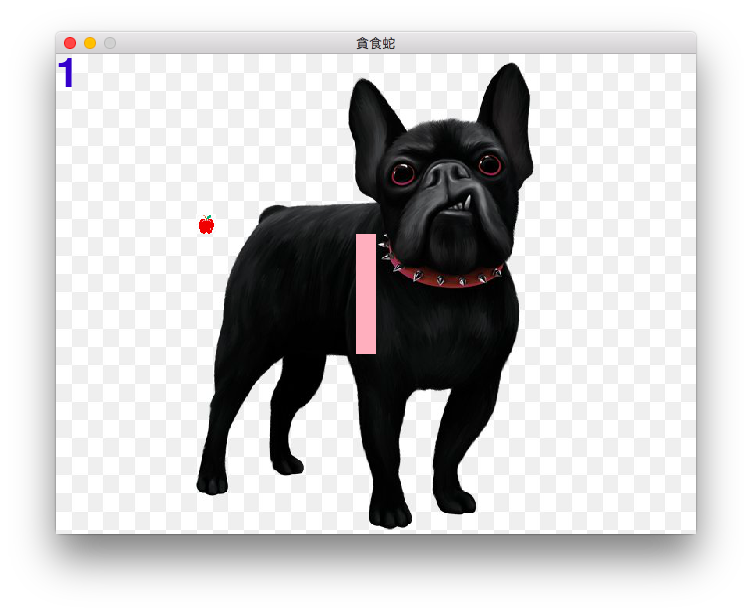
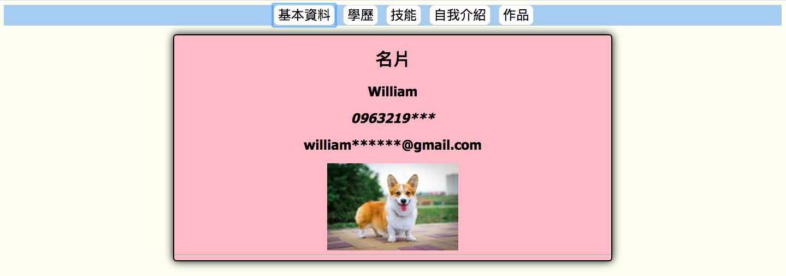

## What we learned
- [x] 貪食蛇
- [x] 網頁設計
- [x] 網頁爬蟲
- [x] 資料分析
- [x] GitHub

## 貪食蛇

### how to use
> cd snake_game  
> python snake.py  

## 網頁設計

### how to launch
> 1. 找到 web_design  
> 2. 把index.html 用網頁打開  

## 網頁爬蟲
練習: ptt nba 版 [結果](web_spider/nba.csv)  

## 資料分析
練習: [covid19病例](pandas/covid19.csv)  

## What we used
>|專案|語言|工具|
>|---|---|---|
>|貪食蛇|python|pygame|
>|網頁|html css javascript|vscode|
>|爬蟲|python|BeautifulSoup|
>|分析|python|pandas|